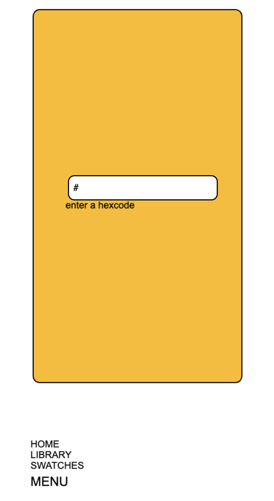
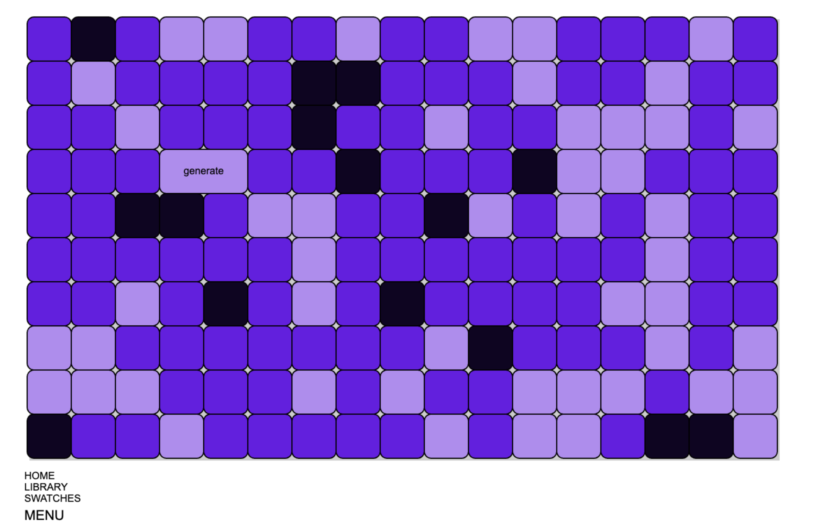
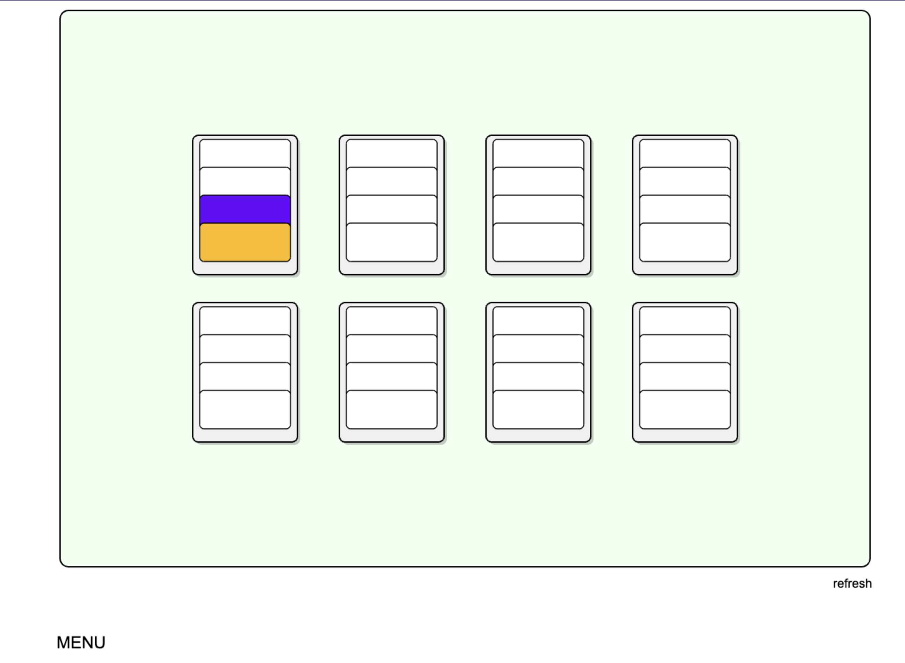
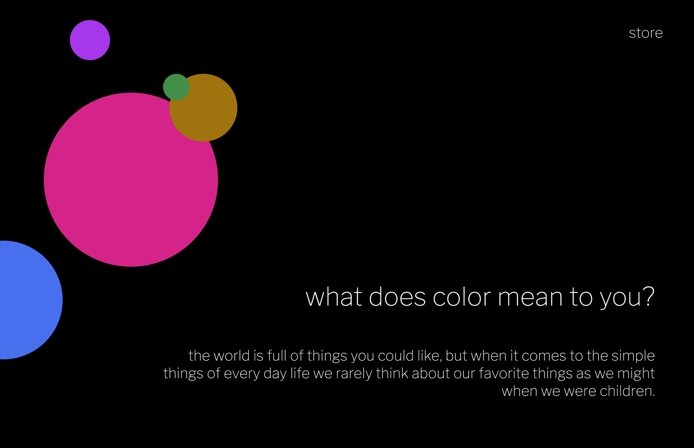
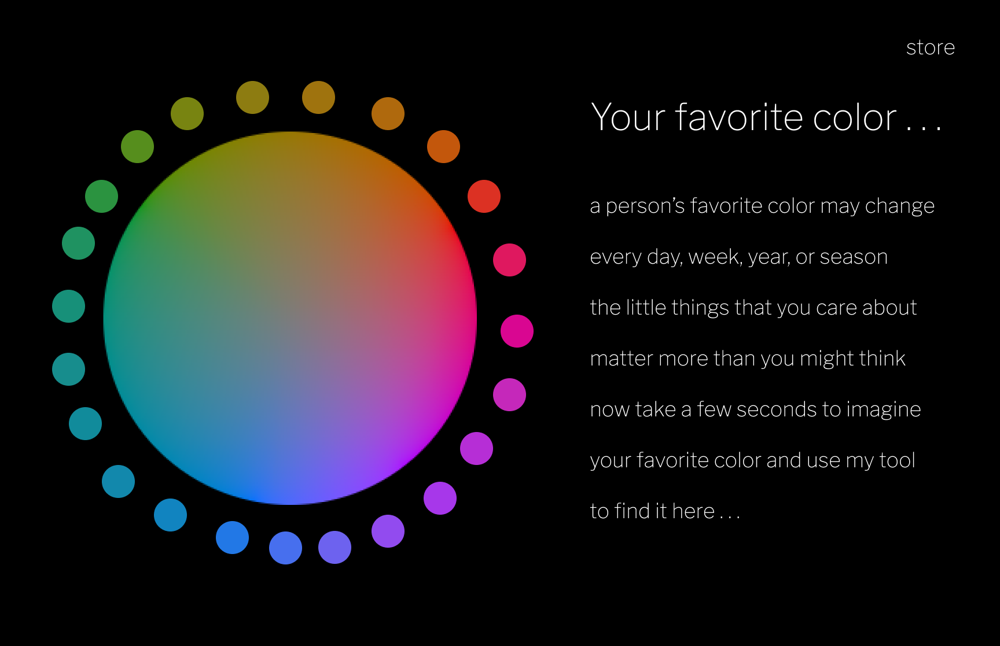
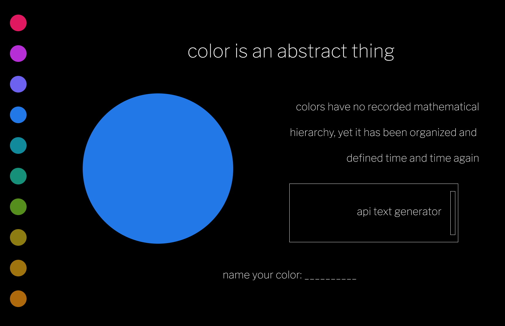

<mark>**Note that this document order from FP4 -> FP1**</mark>

---

# **FP4 \- Final Project Writeup**

Feel free to refer to this [Markdown Cheat Sheet](https://www.markdownguide.org/cheat-sheet/) to make your writeup more organized, and you can preview your markdown file in VSCode [Markdown editing with Visual Studio Code](https://code.visualstudio.com/docs/languages/markdown#_markdown-preview). 

## Part 1: Website Description

My website is an interactive color picker that generates colors from complementary, monochromatic, triadic, and split complementary color ways. You can enter a 6 digit hex code to generate a color palette for any color you desire. Each of these colors are then stored in the color swatches library. These color swatches may be refreshed for a new palette. Overall, my website is a tool that allows designers to bring their color palettes through a cute UI that hopes to inspire other designers while also maintaining a simple interface that is far less overwhelming than other color picker tools. Therefore, the target audience is both the audience I may have at my gallery exhibition, but also, any artist or designer who may need a space to simply breathe and rethink their current design in a digital space. I hoped to create this website to supplement a final art project I am doing for my bachelor's thesis about the importance of color, its culture, and how it interplays with our daily lives. In order to create this website, I used the p5.js and Chroma.js libraries so I could generate unique organic shapes with specific grain and blur filters that imitate the color swatches you may find on a pair of jeans which is inspired by colorful textile work and grainy watercolor. Through a generous variation of animation, adorable artifacts, and some retro visual text styling, I have created a UI that I hope is joyous and simple to interact with.

## Part 2: User Interaction

2. Click on the input box and enter a 6 digit hex code.
3. Click on the refresh button at the top left corner to refresh for different color schemes.
4. Click on the library button at the bottom right corner to navigate to the library page.
5. Click on any of the shapes to navigate back to the home page with that color's generated palette.
6. Click on the reset button at the top right corner to refresh all of the shape swatches into blanks again for a new library. 
7. Click on the back button at the bottom right corner to navigate back to the default home page.
8. Move your mouse around the library page to see a simple glitch animation in the background.
9. Use the tab and enter key presses to navigate through both pages using a screen reader for accessiblity. 

## Part 3: External Tool

1. Javascript library - p5.js
   * This library was made for artists and designers to create compelling graphics with simple arithmetic and geometric functions that are harder to navigate using simple JS. Furthermore, I have a lot of experience with this library so I was comfortable using it.
   * I used it to create both pages in their entirety aside from the buttons, input box, and local storage functionalities. More specifically, I used it to create the gradients, textile like patterns, define organic shapes, and create a glitch like animation for both pages. 
   * Since my website's focus is colors and how to find a color scheme that amtches a hex code for a color you might already want to include in a project, the overall styling and aesthetic of this website is very important in order to create a convincing space for artists and designers to utilize. Additionally, I wanted the website to also have a fun and whimsical look that I find is lacking in a lot of tech spaces currently. 
2. Javascript Library - chroma.js
   * Chroma.js is a library that utilizes the hue, saturation, and luminence of colors instead of te baked in RGB values that p5.js defaults to. This library also has a very intuitive yet powerful mathematical backing that navigates color in a 3D space, allowing you to create colors on the screen that are not prone to the usual desaturation and muddying that most libararies create. (Please look at the chroma.js documentation for this library to better understand this.)
   * I used chroma.js to first transcribe the hex code color from RGB to the HSL space. Then, I utilized trigonometry to go around a hypothetical color wheel to create the four different color palettes I created: complementary, monochromatic, triadic, and split complementary.
   * The main theme of my website is creating intersting color spaces that will look good on both the screen and in real life. Utilizing chroma.js allows me to create convincing color schemes that will best match what unique hex codes (that could map to specific pantone paint swatches) will look like in real life against other generated palettes.

## Part 4: Design Iteration

Describe how you iterated on your prototypes, if at all, including any changes you made to your original design while you were implementing your website and the rationale for the changes. (4-8 sentences max)

## Part 5: Implementation Challenge

What challenges did you experience in implementing your website? (2-4 sentences max)

## Part 6: Generative AI Use and Reflection

Describe how you used Generative AI tools to create this final project (fill in the following information, write \~500 words in total).

Document your use of all GenAI tools — ChatGPT, Copilot, Claude, Cursor, etc. using the template below. Add/Delete rows or bullet points if needed, and replace Tool1/Tool2 with the name of the tool.

### Usage Experiences by Project Aspects

Feel free to edit the column \_ (other?) or add more columns if there's any other aspect in your project you've used the GenAI tools for.

For the following aspects of your project, edit the corresponding table cell to answer:
- *Usage*: Whether you used / did not use this tool for the aspect. Enter [Yes/No]
- *Productivity*: Give a rating on whether this tool makes your productivity for X aspect [1-Much Reduced, 2-Reduced, 3-Slightly Reduced, 4-Not Reduced nor Improved, 5-Slightly Improved, 6-Improved, 7-Much Improved].

| Tool Name | Ratings | design | plan | write code | debug | \_ (other?) |
| :---- | :---- | :---- | :---- | :---- | :---- | :---- |
| Tool1 | Usage | Yes/No | Yes/No | Yes/No | Yes/No | Yes/No |
| Tool1 | Productivity | 1~7 | 1~7 | 1~7 | 1~7 | 1~7 |
| Tool2| Usage | Yes/No | Yes/No | Yes/No | Yes/No | Yes/No |
| Tool2 | Productivity | 1~7 | 1~7 | 1~7 | 1~7 | 1~7 |

### Usage Reflection

> Impact on your design and plan 
* It matched my expectations and plan in [FP2](#generative-ai-use-plan) in that … For example, 
  1. Tool1: 
  2. Tool2:
* It did not match my expectations and plan in [FP2](#generative-ai-use-plan) in that … For example, 
  1. Tool1: 
  2. Tool2:
* GenAI tool did/did not influence my final design and implementation plan because … For example, 
  1. Tool1: 
  2. Tool2:

> Use patterns
* I accepted the generations when …  For example, 
  1. Tool1: this tool once suggested … and I adjusted my design according to the suggestion because … 
  2. Tool2: 
* I critiqued/evaluated the generated suggestions by … For example, 
  1. Tool1: this tool once suggested … but I modified/rejected the suggestion because … 
  2. Tool2: 

> Pros and cons of using GenAI tools
* Pros
  1. Tool1: 
  2. Tool2:
* Cons
  1. Tool1: 
  2. Tool2:

### Usage Log

Document the usage logs (prompts and chat history links) for the GenAI tools you used. Some tools may not have an easy way to share usage logs, just try your best! Some instructions for different tools:

1. [ChatGPT](https://help.openai.com/en/articles/7925741-chatgpt-shared-links-faq) / [Gemini](https://support.google.com/gemini/answer/13743730?hl=en&co=GENIE.Platform%3DDesktop): share the anonymous link to all of your chat histories relevant to this project
2. [GitHub Copilot (VSCode)](https://code.visualstudio.com/docs/copilot/copilot-chat#:~:text=You%20can%20export%20all%20prompts%20and%20responses%20for%20a%20chat%20session%20in%20a%20JSON%20file%20with%20the%20Chat%3A%20Export%20Session...%20command%20(workbench.action.chat.export)%20in%20the%20Command%20Palette.): export chat histories relevant to this project.

---

# **FP3 \- Final Project Check-in**

I have created an entirely new UI for my project that is inspired by pantone color swatches you might find at a local Home Depot or Lowe's. I hope this inspiration for the UI captures the practically of the website. Furthermore, it is an ultra simple design that utilizes rectangles very well so I can focus on implementing the necessary algorithms for this website including: local storage for keeping track of the most recent hex code entered and using this stored variable across all pages to recolor every aspect of the website, create a storage page for color swatches to be saved and refreshed, a color generation page where four different color palettes can be filtered through using the Chroma.js library, and finally mutli page functionality between mobile and desktop devices using Bootstrap. 

## Implementation Plan Updates

- [ ] Finish developing desktop version of the website, it is currently not resizing correctly
- [ ] Make sure all animations including hover animations show up in desktop version
- [ ] Add better animations between swatches page navigation back to library page navigation
- [ ] Make sure all pages are centered properly acorss devices and clicking buttons are easy
- [ ] Add all accessibility feattures including ARIA labels, tabbing functionality, and alt text
- [ ] Change UI to be more visually appealing if I have time
- [ ] Simplify the entire code base and add clear commenting for documentaiton purposes

## Generative AI Use Plan Updates

- [ ] Use AI to help me fix implementation conflicts between Bootstrap and p5.js library
- [ ] Use AI to help me navigate any errors that may come up as I continue to work

Remember to keep track of your prompts and usage for [FP4 writeup](#part-6-generative-ai-use-and-reflection).

---

# **FP2 \- Evaluation of the Final project**

## Project Description

My goal is to create a website that operates as an interactive color picker tool to educate people on my art practice and the importance of resonating with color on a social and cultural level. 

## High-Fi Prototypes

### *Prototype 1*

Formatting is a little confusing for larger screens, there needs to be more pages and text especially a home page to introduce my idea. Have some sort of storage for previous colors picked.

### *Prototype 2*

## Usability Test

I created a version of the above sketches in Figma and made it interactive for users to test out in real time. I asked them to talk aloud about difficulties they had during navigation, interesting visual elements, and what they thought the overall theme of the website was in relation to color theory. 

## Updated Designs

I implemeneted a homepage with a navigation and a short introduction, although it still seems a bit empty so this design may be iterated on a bit more further into the process of this project. I also layed out the circular designs that could engage the users throughout the navigation of the entire website and created a layout that would read well in a scrollable format. 

## Feedback Summary

Some of the feedback included making the website a scrolling based website that utilizes the circles as geometric animations to take users through the entire website. The overall design of the website was very clean and the design was simple, according to users the contrast was good and the visual styling was strong enough to accesible and intuitive. It was discussed to make the user experience as smooth and interesting with animations + colors as possible and possibly focus less on the API idea so as not to clog up the overall theme of the website. Finally, users felt the website felt a little incomplete and slideshow like due to the design of the homepage and suggested to add more assets such as a navigation bar and other similar functionalities. 

## Milestones

I hope to continue prototyping a bit more on the homepage specificially this week and start to build out each page's overall structure in HTML by the end of this week. After that, I will take my work flow over to P5.js in the next week and try to finish all the animation and color picker logic. Then I will simply do some finishing touches in order to port everything and organize the separate parts utilizing Javascript/JSON, test for multimodal screen functionality using Bootstrap, and do some accessibility testing. 

### *Implementation Plan*

- [ ] Week 9 Oct 28 \- Nov 1:
  - [X] FP1 due
  
- [ ] Week 10 Nov 4 \- Nov 8:   
  - [X] FP2 due

- [ ] Week 11 Nov 11 \- Nov 15: homepage iterations, basic HTML and CSS styling, start p5.js animations
- [ ] Week 12 Nov 18 \- Nov 22: finish p5.js animations and use chroma.js for color picker functionality
- [ ] Week 13 Nov 25 \- Nov 29: port everything together, format using Javascript and Bootstrap

  - [ ] Thanksgiving  
- [ ] Week 14 Dec 2 \- Dec 6: do any remainder finishing touches and some more usability testing for error handling
  - [ ] FP4 due 

### *Libraries and Other Components*

* p5.js
* chroma.js

## Generative AI Use Plan

I may use Perplexity Pro to help me do error handling while coding in any of the various langauges while building out the overall website feel, and help with the math required for some of the color picker functionality. Finally, I may also ask for some help when doing CSS styling using flexbox and when using Bootstrap. 

### *Tool Use*

What would you use? Edit the list given your plan. For each tool, explain briefly on what do you expect Generative AI to help you with and what might it not be able to help you with.

* Perplexity Pro
  * I will use it to help me with math since color pickers can become very computationally heavy to organize.
  * I will use it to help me with error handling and CSS styling since it can help me figure out why an artifact may not be showing up on screen as I want it to.
  * I will not use it to organize my overall HTML, CSS, or Javascript since it does not allow for unique visual styling or good organizational practices. 

### *Responsible Use*

I will minimize my use of Generative AI so as not to use too much enivronmental reasources during my project. I will only use it when absolutely necessary to do tricky math or error handling since that may be a time consuming task for me to do alone and AI can easily do this. I will not use it for the overall visual styling, textual theme, or overall feel of my website.

# **FP1 \- Proposal for Critique**

## Idea Sketches

### *Idea 1*

* I want to creative and interactive and narrative based website that explores the role of color from a cultural and visual perspective.
* In order to do the above, I will use p5.js and Chroma.js to create a color picker tool and narrative elements, including poetry, literature,
* and lyrics about the chosen color through APIs.
* I will use alt text and clear explanations on screen about how to visually navigate my website, alongside how to save chosen colors, and the significance of the functionality. 
* I want to convey the importance of applying your own desires onto the artistic narratives of others by dictating which colors you prefer to see on the canvas. 

### *Idea 2*

* A simple portfolio that strongly shows my artistic abilities alongside my natural curiosity for design and computability.
* I plan to use interesting animations and timelines to showcase my work and possibly have embedded interactivity through small software applications I have already developed.
* I plan to include alt text and clear design that make it obvious which buttons to press, alongside good styling for readers to parse through the outline of each page.
* I want to convey my own interests and skillsets to my audience.

### *Idea 3*

* This website will host an interactive design tool that utilizes my previous applications for creating generative patterns in my unique stylizations and projects
* them onto patterns for sewing and fashion designing ideas.
* I plan to use engaging models and 3D turn arounds of the items after the patterns are generated to create a novel experience with each mouse click!
* I plan to include alt text and clear design that make it obvious which buttons to press, alongside good styling for readers to parse through the outline of each page.
* I want to showcase a proof of concept for my idea of how to use generative software that is distinctly stylized in traditional textile pattern making. 

## Feedback Summary

The feedback I recieved was mainly in reguards to my first idea since that is the one I am most likely to choose. However, people did enjoy the third idea and said it
is interesting at a high level but a little out of scope for my current abilities and available time. For the first idea, many people said to include a homepage and clear
instructional text at every step of the way since my tool is very exploratory and it might not be intuitive to users as to WHY they are using the tool (although the design
is self explanatory and my peers said it would be easy to assume what the functionality is). Therefore, having a narrative style walkthrough with a strong landing page
before the more visual elements are introduced was suggested and changing the formatting of the actual interactive color picker tools that I create in p5.js for mobile 
devices versus laptop/desktop formatting was also discussed. It would also be nice to have a library that stores which colors users picked as another functionality.
Finally, my peers enjoyed the idea of utilizing text as a supplementary visual element and the idea of using APIs to search for text that would be relevent to 
my project as the ending page. 

## Feedback Digestion

I will definitely create a narrative style website instead of an entirely visual one, and focus on designing a strong landing page. I will also develop the API functionality
if I have time. Both of these ideas were thought of by me in response to my peer's constructive critisms. I think I will also create a library of the colors that users pick,
since that would make the overall functionality of the website better, however, I am not sure if I am completely tied to the idea yet since I am hoping to create a more 
ephemeral feel to this project. 
